<p align="center">
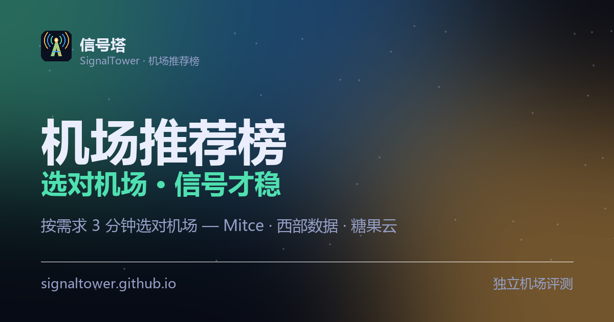
</p>

# 机场推荐 2026｜科学上网机场评测与对比 · 信号塔 SignalTower

**信号塔 · SignalTower** 是独立的 **机场推荐 / 机场评测** 开源仓库与站点，汇总 38 家高速稳定 **科学上网机场**（翻墙机场 / 代理订阅服务），按线路类型（IEPL 专线、直连、中转）、协议（Trojan、VLESS、Reality、Hysteria2、Shadowsocks）、Netflix / Disney+ / ChatGPT 解锁与性价比横向对比，帮你 3 分钟选对机场。

在线站点：**[555736.xyz](https://555736.xyz/)** ｜ 本仓库：**[signaltowers/signaltowers.github.io](https://github.com/signaltowers/signaltowers.github.io)** ｜ 数据更新：2026-07

精选包括：Mitce、西部数据 WestData、守候 Shouhou、糖果云 CandyCloud、红杏云 HongXing、自由猫 FreeCat 等。价格与优惠码可能随官网调整，请以各机场官网为准。

<p align="center">
<a href="https://i.rtxk.us/i/r37kbkg"></a>
<a href="https://i.rtxk.us/i/r37kbkg"></a>
</p>

> ### 🦁 推荐搭配：[Leonis AI 中转站](https://i.rtxk.us/i/r37kbkg) —— 一个端点，抵达所有模型
>
> **机场解决「连得上」，Leonis AI 解决「用得顺」。** 两件事互补，谁也替代不了谁：节点买好了，人却还在 Claude Code、Codex CLI、Cherry Studio 之间反复改环境变量、换 Base URL、粘密钥。
>
> Leonis AI 把各家大模型的订阅额度统一成同一个 API 端点——**不改代码、不换客户端，只替换一行 Base URL**，Claude、GPT、Gemini、Grok、Antigravity 等 **6+ 模型共用一把 `sk-` 密钥**。
>
> - **原生工具直连** —— 官方 CLI 直接用，不需要额外插件或魔改
> - **全程流式不缓冲** —— 长回答边生成边吐字，不会卡到最后一次性蹦出来
> - **多账号池调度** —— 后端多号轮询，单号被限流时自动顶上，稳定性更好
> - **一个密钥全模型** —— Claude、GPT、Gemini 共用一把 `sk-` 密钥，省心
>
> ```bash
> export ANTHROPIC_BASE_URL=https://ai.svtun.cn
> export ANTHROPIC_AUTH_TOKEN=sk-你的密钥
> claude
> ```
>
> OpenAI 兼容客户端用 `https://ai.svtun.cn/v1`；也支持 cc-switch 桌面工具「导入到 CCS」一键导入。邮箱注册几十秒完成，注册即送体验额度。
>
> **[🦁 Leonis AI · 免费注册领体验额度 ↗](https://i.rtxk.us/i/r37kbkg)** · **[📖 cc-switch 接入教程 ↗](https://guide.rtxk.us/tutorial/ai-coding/leonis-ai-cc-switch-guide.html)**

---

## 目录

- [本仓库是什么](#本仓库是什么)
- [2026 精选机场榜单](#2026-精选机场榜单)
- [Emby 影音机场推荐](#emby-影音机场推荐)
- [机场快速对比表](#机场快速对比表)
- [30 秒教你怎么选机场](#30-秒教你怎么选机场)
- [新手入门：第一次用机场](#新手入门第一次用机场)
- [常见问题 FAQ](#常见问题-faq)
- [相关搜索词](#相关搜索词)
- [免责声明](#免责声明)

---

## 本仓库是什么

很多人搜索「**机场推荐**」「**哪家机场好**」「**科学上网机场**」「**稳定机场评测**」时，会刷到大量广告站或过期榜单。本项目把 **评测内容、对比表、决策指南** 开源在 GitHub，并同步发布到 GitHub Pages，方便检索、收藏与二次核对。

| 项目 | 说明 |
| --- | --- |
| 仓库名 | `signaltowers/signaltowers.github.io` |
| 线上站点 | [https://555736.xyz](https://555736.xyz/) |
| 收录机场 | **38** 家（榜单 + 机场大全） |
| 更新节奏 | 随套餐 / 线路变动维护（当前 2026-07） |
| 数据来源 | 公开套餐信息 + 场景向评测摘要 |
| 使用方式 | 打开站点挑机场，或直接读下方榜单与对比表 |

**你会得到：**

- 按稳定性 / 性价比 / 追剧 / 大流量等场景的 **机场推荐**
- 每家机场的 **线路类型、协议、解锁、起步价、适合人群**
- 独立 SEO 详情页（可分享、可搜索）：例如 [Mitce](https://555736.xyz/mitce/) · [西部数据](https://555736.xyz/westdata/) · [守候](https://555736.xyz/shouhou/) · [糖果云](https://555736.xyz/candycloud/) …
- 新手避坑：月付试水、多机场容灾、客户端与协议匹配

English: Independent **proxy / VPN-like subscription (机场)** reviews and rankings for 2026 — compare IEPL dedicated lines, VLESS Reality, Hysteria2, Trojan, Netflix & ChatGPT unlock, and pricing.

---

## 2026 精选机场榜单

以下为 **38 家机场** 的推荐与评测摘要，按「综合稳定性 + 性价比 + 场景适配」整理。完整图文评测见各机场详情页。

### 01. Mitce 机场推荐  ·  「榜一推荐」

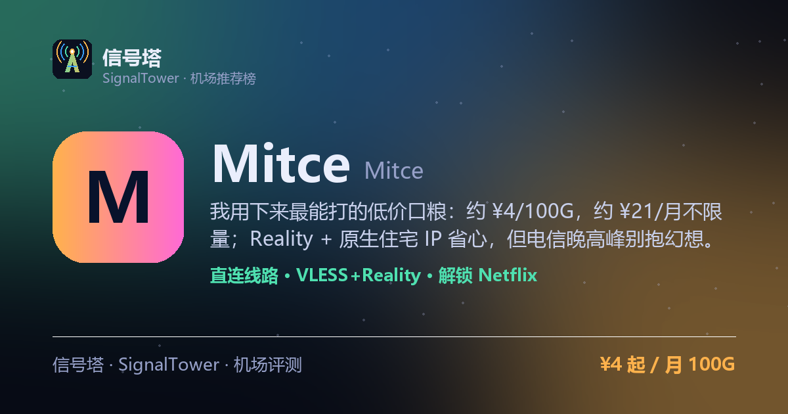

> 我用下来最能打的低价口粮：约 ¥4/100G，约 ¥21/月不限量；Reality + 原生住宅 IP 省心，但电信晚高峰别抱幻想。

- **线路类型**：直连（部分 BGP 中转）
- **主要协议**：VLESS+Reality · Hysteria2
- **流媒体解锁**：Netflix · Disney+ · ChatGPT
- **覆盖地区**：德 · 英 · 港 · 日 · 韩 · 新 · 台 · 美（8 地）
- **起步价**：¥4 起 / 月 100G（低价月付 / 不限流量套餐）
- **最适合**：性价比 / 新手主推

口粮机场里我第一个推它。约 ¥4 拿 100G、约 ¥21 直接不限量敞开造，这价在 2026 年还能打的没几家；VLESS+Reality 抗封，套餐自带原生住宅 IP，挂 ChatGPT、刷流媒体基本不用管。缺点也直说：直连线路电信晚高峰会拉胯，追求极致低延迟就再备一家专线，别指望它一家包打。日常党闭眼冲。

**完整评测与优惠信息 → [Mitce 机场评测](https://555736.xyz/mitce/)**

### 02. 西部数据 WestData 机场推荐  ·  「专线稳王」

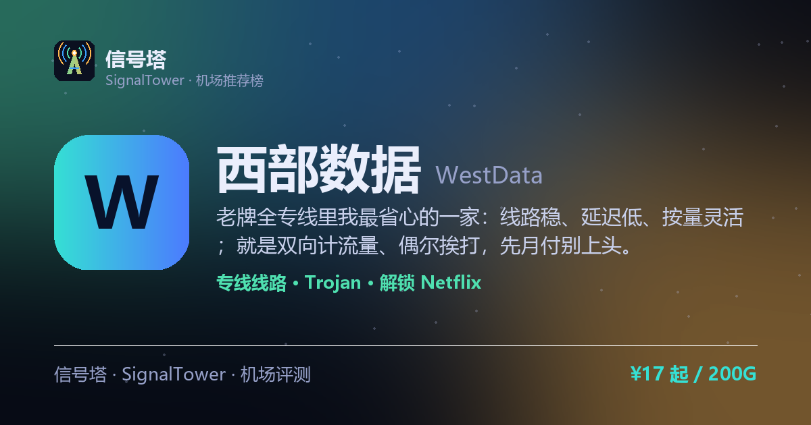

> 老牌全专线里我最省心的一家：线路稳、延迟低、按量灵活；就是双向计流量、偶尔挨打，先月付别上头。

- **线路类型**：IEPL/IPLC 全专线
- **主要协议**：Trojan
- **流媒体解锁**：Netflix · Disney+ · ChatGPT
- **覆盖地区**：香港 · 日本 · 美国 · 德国 等
- **起步价**：¥17 起 / 200G（按量计费 ≈ 0.08 元/G）
- **最适合**：稳定专线党

老牌全专线里我用得最省心的一家：IEPL/IPLC 多入口就近接入，线路稳、延迟低，按量花多少买多少。毛病也不藏，双向计流量不算便宜，偶尔挨打也会抖；先上个月付试水，别看老牌就急着年付。把稳定放第一的可以冲。

**完整评测与优惠信息 → [西部数据 WestData 机场评测](https://555736.xyz/westdata/)**

### 03. 守候 Shouhou 机场推荐  ·  「老牌稳健」

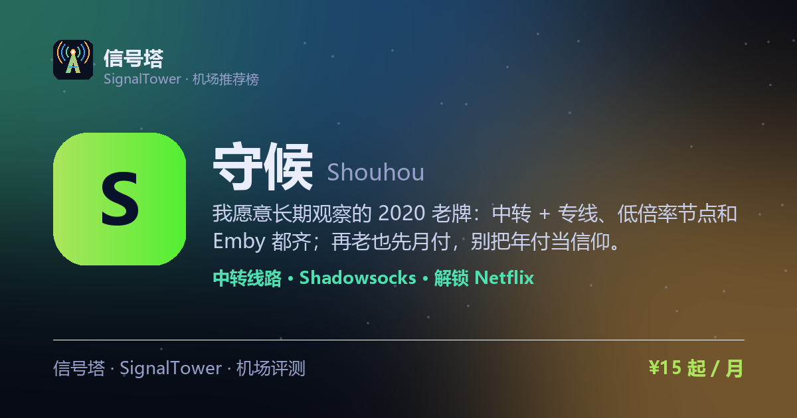

> 我愿意长期观察的 2020 老牌：中转 + 专线、低倍率节点和 Emby 都齐；再老也先月付，别把年付当信仰。

- **线路类型**：公网中转 + IPLC 专线
- **主要协议**：Shadowsocks
- **流媒体解锁**：Netflix · Disney+ · ChatGPT · Emby 影视库
- **覆盖地区**：香港 · 台湾 · 新加坡 · 美国 等 10+ 地区
- **起步价**：¥15 起 / 月（包月 / 包年）
- **最适合**：稳健老用户 / Emby 影音

我看守候最顺眼的是它从 2020 年熬到现在：中转和专线入口都给，节点够多，还有低倍率节点省流量，Emby 影视库装客户端就能看。老牌不等于免死金牌，线路也不可能天天满血；我照样建议先月付观察，再考虑年付。想找长期主力又爱追剧的，先试它。

**完整评测与优惠信息 → [守候 Shouhou 机场评测](https://555736.xyz/shouhou/)**

### 04. 糖果云 CandyCloud 机场推荐  ·  「影视之选」

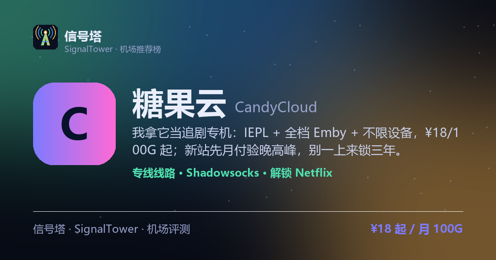

> 我拿它当追剧专机：IEPL + 全档 Emby + 不限设备，¥18/100G 起；新站先月付验晚高峰，别一上来锁三年。

- **线路类型**：IEPL 专线
- **主要协议**：Shadowsocks · V2Ray
- **流媒体解锁**：Netflix · Disney+ · ChatGPT · Emby 影视库
- **覆盖地区**：香港 · 日本 · 新加坡 等
- **起步价**：¥18 起 / 月 100G（月付 / 季付 / 半年 / 年付（至 3 年付））
- **最适合**：影视追剧旗舰

我把它归到追剧专用档：全线极速定制 IEPL，四档都送 Emby，设备不限，家里几台一起看不用抠并发；入门 ¥18/100G，官网把 600G 档标成「火爆」款。别被月付到 3 年付的选项带节奏，它毕竟是新锐机场，先买月付小档验证晚高峰，跑稳再续。重度追剧党可以试。

**完整评测与优惠信息 → [糖果云 CandyCloud 机场评测](https://555736.xyz/candycloud/)**

### 05. 红杏云 HongXing 机场推荐  ·  「流媒体高性价比」

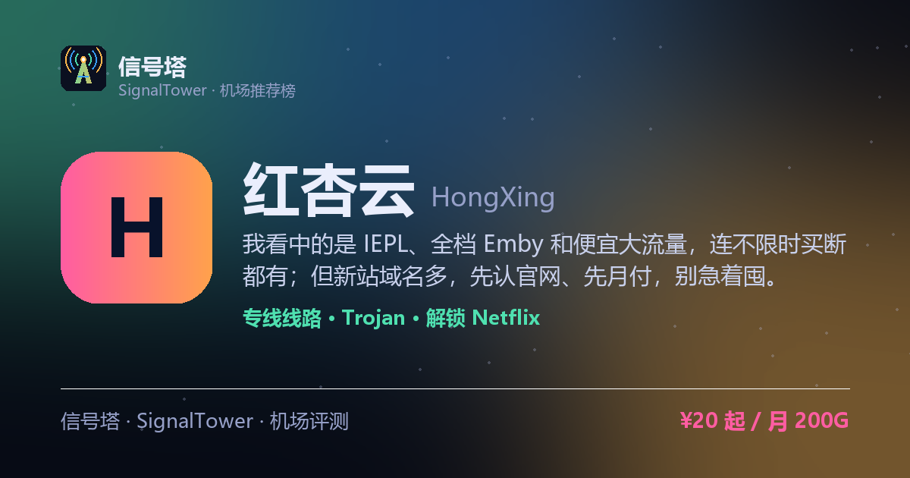

> 我看中的是 IEPL、全档 Emby 和便宜大流量，连不限时买断都有；但新站域名多，先认官网、先月付，别急着囤。

- **线路类型**：IEPL 专线
- **主要协议**：Trojan · Hysteria2
- **流媒体解锁**：Netflix · Disney+ · ChatGPT · Emby 影视库
- **覆盖地区**：香港 · 日本 · 台湾 · 新加坡 · 美国 等
- **起步价**：¥20 起 / 月 200G（月付（至 3 年付）/ 不限时买断）
- **最适合**：流媒体 / 大流量性价比

升级全线 IEPL 后它确实更能打：月付四档都送 Emby、设备不限，¥80/1200G 对大流量党够狠；3000G/6000G 不限时买断也适合囤着当备用。我不建议看见大包就梭哈：备用域名多，先认准官方地址，而且它还是新站，月付验证晚高峰后再碰 ¥388/¥688 的买断。追剧兼囤量的可以上。

**完整评测与优惠信息 → [红杏云 HongXing 机场评测](https://555736.xyz/hongxing/)**

### 06. 自由猫 FreeCat 机场推荐  ·  「日常主力」

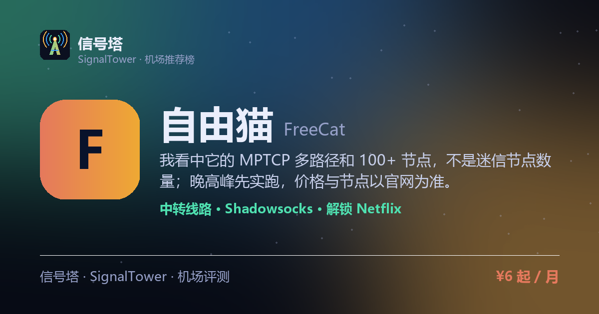

> 我看中它的 MPTCP 多路径和 100+ 节点，不是迷信节点数量；晚高峰先实跑，价格与节点以官网为准。

- **线路类型**：MPTCP 多路径中转
- **主要协议**：Shadowsocks · Trojan · VLESS
- **流媒体解锁**：Netflix · Disney+ · ChatGPT
- **覆盖地区**：香港 · 日本 · 美国 · 新加坡 等 20+ 地区
- **起步价**：¥6 起 / 月（包月 / 包季 / 包年）
- **最适合**：日常主力

我会因为 MPTCP 多路径把它放进晚高峰候选，运营时间也不算短，拥堵时比普通单路中转更有底气，适配面够广。别把「100+ 节点」直接等同于每条都快，节点、价格和实际可用情况一律以官网为准；先挑月付跑一轮自己的晚高峰。要抗拥堵主力的值得试。

**完整评测与优惠信息 → [自由猫 FreeCat 机场评测](https://555736.xyz/freecat/)**

### 07. 淘气兔 TaoQiTu 机场推荐  ·  「联通移动友好」

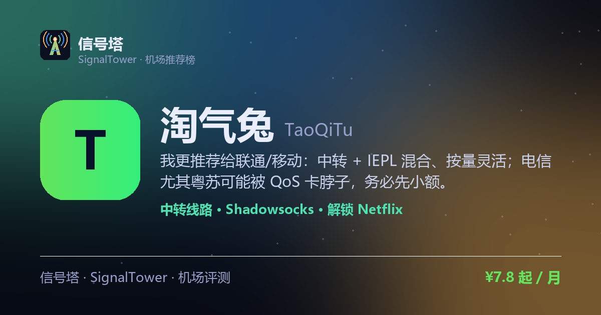

> 我更推荐给联通/移动：中转 + IEPL 混合、按量灵活；电信尤其粤苏可能被 QoS 卡脖子，务必先小额。

- **线路类型**：中转 + IEPL 专线
- **主要协议**：Shadowsocks · Trojan
- **流媒体解锁**：Netflix · ChatGPT
- **覆盖地区**：日本 · 香港 等（Amazon 中转为主）
- **起步价**：¥7.8 起 / 月（包月 / 按量）
- **最适合**：联通移动用户

我喜欢它把普通中转和 IEPL 专线都摆出来，按量也灵活，联通、移动用户更容易吃到性价比。电信党先别闭眼冲，尤其粤苏地区可能撞上 QoS 限速，专线还按 2 倍率扣流量；先小额把常用时段跑通，再决定当不当主力。非电信用户优先。

**完整评测与优惠信息 → [淘气兔 TaoQiTu 机场评测](https://555736.xyz/taoqitu/)**

### 08. 渔云 YuYun 机场推荐  ·  「专线新锐」

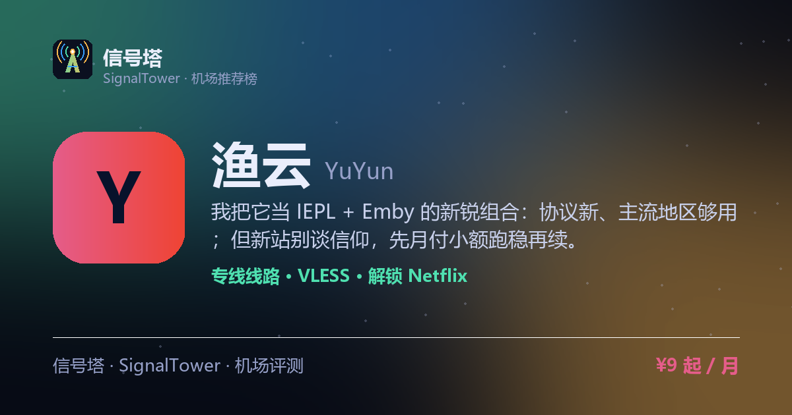

> 我把它当 IEPL + Emby 的新锐组合：协议新、主流地区够用；但新站别谈信仰，先月付小额跑稳再续。

- **线路类型**：IEPL 专线 + 中转
- **主要协议**：VLESS · Hysteria2
- **流媒体解锁**：Netflix · Disney+ · ChatGPT · Emby 影视库
- **覆盖地区**：香港 · 日本 · 台湾 · 新加坡 · 美国 等
- **起步价**：¥9 起 / 月（包月 / 按量）
- **最适合**：长期稳定 / Emby 影音

我看中的是它没拿低价乱冲，而是用 IEPL、较新协议和全套餐 Emby 做长期路线，主流地区也够日常用。话说回来，新站写再多「稳定」都只是开场白，社区和时间才是裁判；先月付小额验证晚高峰和 Emby 可用性，跑稳再长期用。想一份订阅兼顾主力和追剧的可以试。

**完整评测与优惠信息 → [渔云 YuYun 机场评测](https://555736.xyz/yuyun/)**

### 09. 神龙 ShenLong 机场推荐  ·  「IEPL 永久专线」

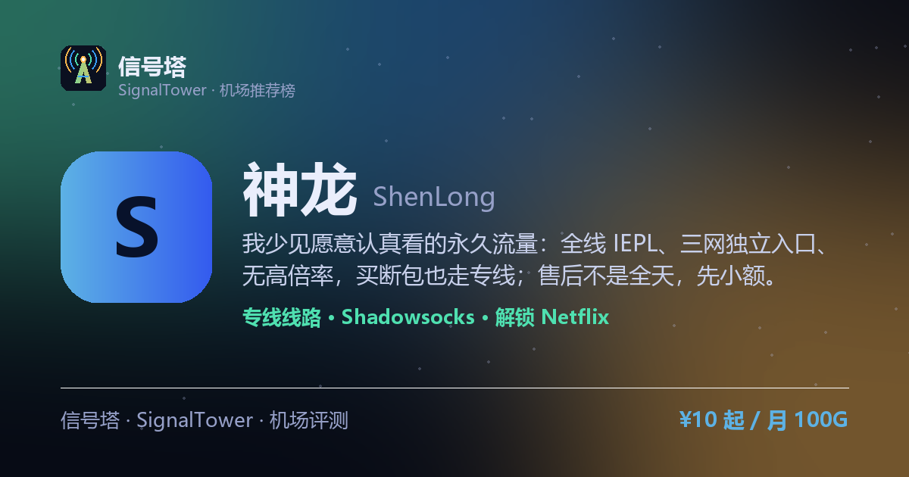

> 我少见愿意认真看的永久流量：全线 IEPL、三网独立入口、无高倍率，买断包也走专线；售后不是全天，先小额。

- **线路类型**：全线 IEPL 专线
- **主要协议**：Shadowsocks · VMess · Trojan
- **流媒体解锁**：Netflix · Disney+ · ChatGPT
- **覆盖地区**：三网独立入口 · IEPL 专线节点（以官网为准）
- **起步价**：¥10 起 / 月 100G（月付 / 永久买断）
- **最适合**：IEPL 专线 · 永久流量

这家的亮点我认：整条链路走 IEPL，三网独立入口、无高倍率，原生家宽 IP 对流媒体也友好；连 256G/512G/1024G 的永久买断包都给专线，不是拿边角料糊弄。不足也摆桌上，售后只在 12:00–21:00，永久套餐更不能因为名字好听就梭哈；先小额验证自己的入口和晚高峰。想要专线又懒得月月续费的再上。

**完整评测与优惠信息 → [神龙 ShenLong 机场评测](https://555736.xyz/shenlong/)**

### 10. 边界云加速器 LVPN 机场推荐  ·  「商务办公优选」

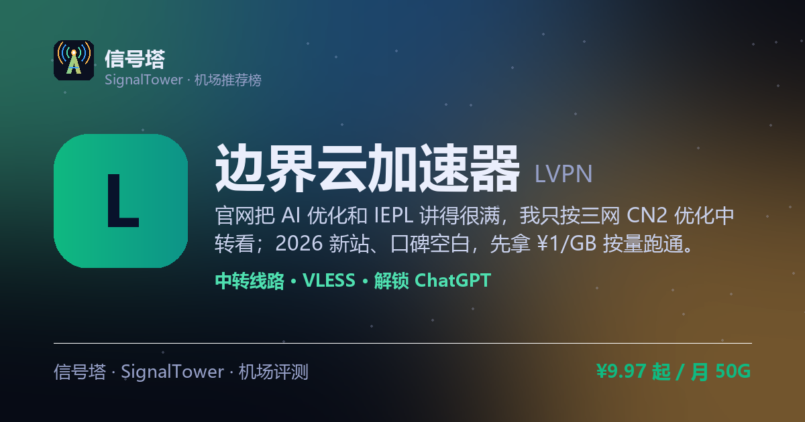

> 官网把 AI 优化和 IEPL 讲得很满，我只按三网 CN2 优化中转看；2026 新站、口碑空白，先拿 ¥1/GB 按量跑通。

- **线路类型**：优化中转（官网称 IEPL 优化线路 · 尊享 Pro 含国内低延迟专线入口）
- **主要协议**：VLESS
- **流媒体解锁**：ChatGPT · Claude · Gemini · Netflix · Disney+ · YouTube 4K
- **覆盖地区**：香港 · 日本 · 新加坡 核心入口为主，官网宣称 50+ 全球节点（亚太 / 北美 / 欧洲）
- **起步价**：¥9.97 起 / 月 50G（季付 / 半年付 / 年付 · 另有 ¥1/GB 按量付费）
- **最适合**：AI 优化 + 稳定办公

官网吹「IEPL 优化线路 / 50+ 全球节点」，独立实测其实是 DMIT 香港三网 CN2 优化中转，并非骨干 IEPL——宣传成分需打折看。它对 ChatGPT/Claude/Gemini 和流媒体做了适配，Pro 也给低延迟入口、低负载节点和工单优先，但 2026 年 5 月末才开业，社区独立口碑基本空白；VLESS 单协议、通用订阅还不支持一键导入。我的建议很简单：认准 lvpn.cc，先拿 ¥1/GB 按量或小额月付跑通晚高峰，别一上来碰大额年付。

**完整评测与优惠信息 → [边界云加速器 LVPN 机场评测](https://555736.xyz/lvpn/)**

### 11. Tapcloud 机场推荐  ·  「全平台解锁」

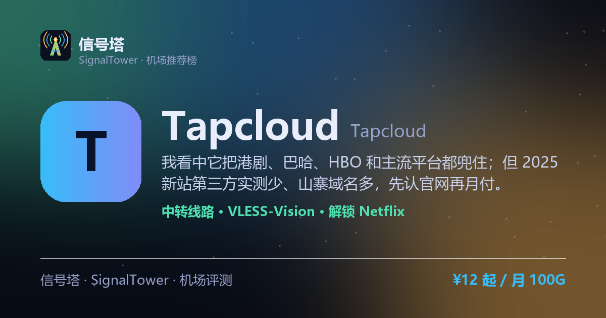

> 我看中它把港剧、巴哈、HBO 和主流平台都兜住；但 2025 新站第三方实测少、山寨域名多，先认官网再月付。

- **线路类型**：公网中转（含 IEPL 专线档）
- **主要协议**：VLESS-Vision · Hysteria2 · AnyTLS
- **流媒体解锁**：Netflix · Disney+ · ChatGPT · MyTVSuper · HBO · Bahamut
- **覆盖地区**：洛杉矶 · 法兰克福 · 东京 · 新加坡 · 香港 等 25+ 国家
- **起步价**：¥12 起 / 月 100G（月付（至 3 年付）/ 不限时流量包）
- **最适合**：全平台流媒体解锁

论解锁清单它确实能打：Netflix、Disney+、ChatGPT 之外，MyTVSuper、巴哈姆特、HBO、BiliBili 港澳台也覆盖，家庭共享和不限时流量包都给了，官网还标到最高 5000Mbps。可我不会拿宣传带宽当实测，Tapcloud 是 2025 新中转站，第三方实测缺乏，又有山寨和换域名问题；优惠也以官网为准。务必认准官方地址，先小额月付验证晚高峰，再谈长期。

**完整评测与优惠信息 → [Tapcloud 机场评测](https://555736.xyz/tapcloud/)**

### 12. Tifa 机场推荐  ·  「不限设备口粮」

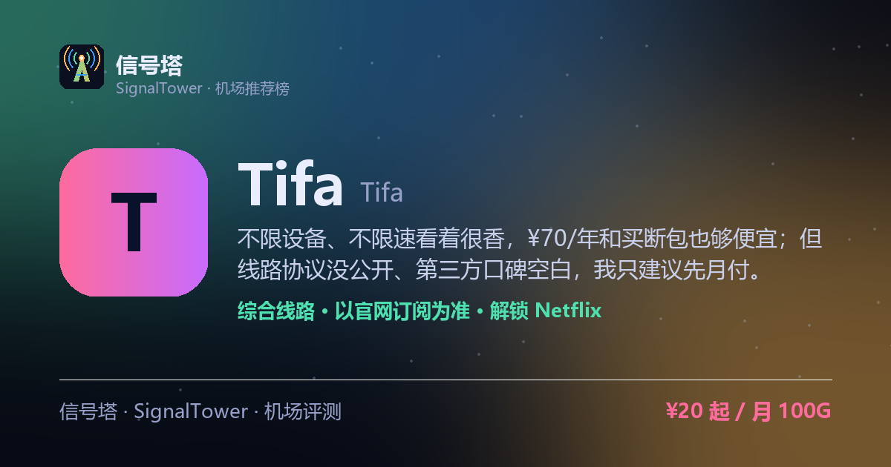

> 不限设备、不限速看着很香，¥70/年和买断包也够便宜；但线路协议没公开、第三方口碑空白，我只建议先月付。

- **线路类型**：线路未公开（登录后查节点状态）
- **主要协议**：以官网订阅为准
- **流媒体解锁**：Netflix · Disney+ · YouTube
- **覆盖地区**：未公开（登录后在「节点状态」查看）
- **起步价**：¥20 起 / 月 100G（月付 / 年付 / 一次性不限时买断）
- **最适合**：不限设备 · 平价口粮

我承认「不限设备 + 不限速」对全家多端很有吸引力，月付、¥70/年传家宝和 500G/1000G 买断档也够全。问题比卖点更要命：官网公开页没披露协议和线路类型，第三方评测与社区口碑基本空白，还是低知名度新站；没进跑路黑名单不等于稳。先月付小额验证解锁和晚高峰，跑稳再考虑年付或买断，别拿便宜当护身符。

**完整评测与优惠信息 → [Tifa 机场评测](https://555736.xyz/tifa/)**

### 13. 快雷GO Kuailei GO 机场推荐  ·  「晚高峰加速」

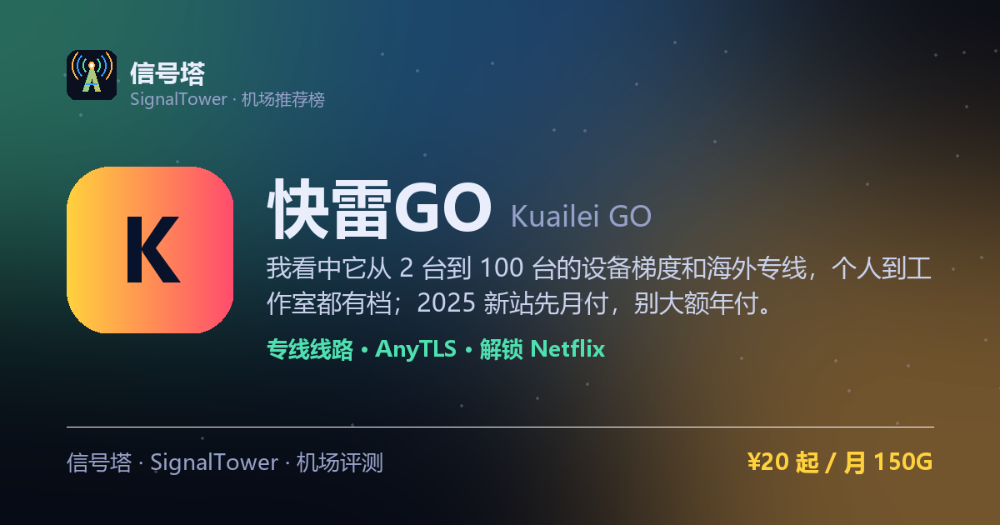

> 我看中它从 2 台到 100 台的设备梯度和海外专线，个人到工作室都有档；2025 新站先月付，别大额年付。

- **线路类型**：IEPL 专线 + 直连
- **主要协议**：AnyTLS · VLESS
- **流媒体解锁**：Netflix · Disney+ · ChatGPT · TikTok
- **覆盖地区**：香港 · 日本 · 台湾 · 美国 · 新加坡 · 马来西亚 等
- **起步价**：¥20 起 / 月 150G（月付(订单日重置) / 不限时流量包）
- **最适合**：专线加速 · 全设备档

快雷GO 的卖点不绕：海外专线按 200→500→1000Mbps 分档，TikTok、Instagram、YouTube、奈飞、迪士尼和 ChatGPT 都往一份订阅里塞；2 台到 100 台的设备档尤其适合从个人扩到团队，不限时流量包还能防失联。但「快」是官网口径，不是我的空口测速，它又是 2025 新站；先月付小档跑晚高峰，别一上来大额年付。多设备团队再重点看。

**完整评测与优惠信息 → [快雷GO Kuailei GO 机场评测](https://555736.xyz/kuailei/)**

### 14. 好鸭 NiceDuck 机场推荐  ·  「追剧全能」

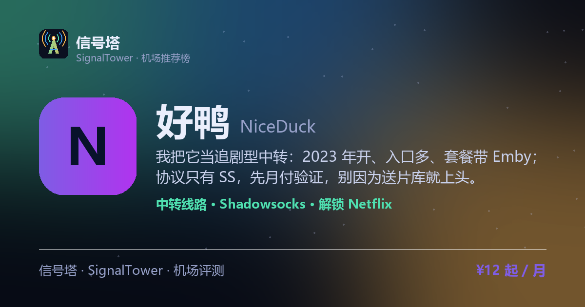

> 我把它当追剧型中转：2023 年开、入口多、套餐带 Emby；协议只有 SS，先月付验证，别因为送片库就上头。

- **线路类型**：多入口隧道中转
- **主要协议**：Shadowsocks
- **流媒体解锁**：Netflix · Disney+ · YouTube · ChatGPT · Emby 影视库
- **覆盖地区**：香港 · 日本 · 台湾 · 新加坡 · 美国 · 韩国 · 澳门 等
- **起步价**：¥12 起 / 月（包月 / 包季 / 包年）
- **最适合**：追剧兼解锁

好鸭的路子很清楚：多入口中转对国内接入比较友好，套餐再绑一个 Emby 影视库，追剧和解锁一份解决。它目前暂未见大规模跑路问题，但协议只有 Shadowsocks，选择少就是选择少，别硬吹万能；我会先月付验证自己的入口、晚高峰和 Emby，再决定要不要当主力。追剧党可先试。

**完整评测与优惠信息 → [好鸭 NiceDuck 机场评测](https://555736.xyz/niceduck/)**

### 15. 流量光 LiuLiangGuang 机场推荐  ·  「流媒体重度」

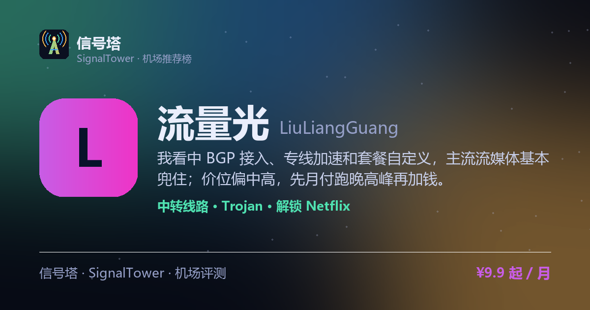

> 我看中 BGP 接入、专线加速和套餐自定义，主流流媒体基本兜住；价位偏中高，先月付跑晚高峰再加钱。

- **线路类型**：BGP 中转 + 专线可选
- **主要协议**：Trojan · Shadowsocks
- **流媒体解锁**：Netflix · Disney+ · HBO · Spotify · TikTok · ChatGPT
- **覆盖地区**：主流地区 + 含冷门国家（以官网为准）
- **起步价**：¥9.9 起 / 月（包月 / 自定义）
- **最适合**：流媒体重度

节点多、Netflix/Disney+/HBO 和 ChatGPT 都覆盖，还能自己调流量与设备数，这种灵活我喜欢；国内 BGP 接入配专线加速也适合做重度解锁主力。槽点是价格不走便宜路线，宣传的全解锁也得拿自己的常用节点验证。先月付跑晚高峰，别没测就买大额。重度流媒体用户再冲。

**完整评测与优惠信息 → [流量光 LiuLiangGuang 机场评测](https://555736.xyz/llguang/)**

### 16. NiceCloud 机场推荐  ·  「灵活流量」

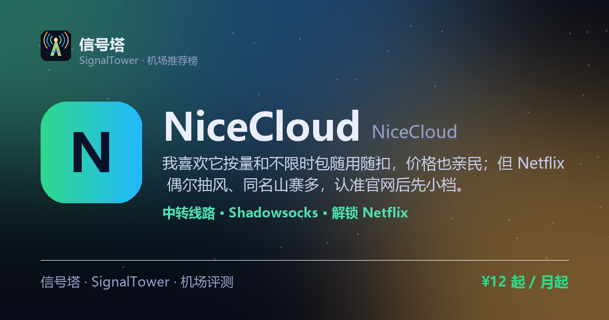

> 我喜欢它按量和不限时包随用随扣，价格也亲民；但 Netflix 偶尔抽风、同名山寨多，认准官网后先小档。

- **线路类型**：公网中转隧道
- **主要协议**：Shadowsocks · SSR
- **流媒体解锁**：Netflix · Disney+ · ChatGPT · TikTok
- **覆盖地区**：香港 · 日本 · 台湾 · 美国 · 新加坡 等
- **起步价**：¥12 起 / 月起（月付 / 按量 / 不限时流量包）
- **最适合**：性价比 / 灵活流量

2022 年做到现在，NiceCloud 最实用的还是按量和不限时流量包：SS 全中转，流媒体与 ChatGPT 日常够用，价格也不端着。我不会把它吹成全能主力，它走国内中转并做常规审计，Netflix 偶尔会短暂失效，市面上还有同名山寨站。认准官方地址，先按量或月付小档试用；轻中度主力或备用更合适。

**完整评测与优惠信息 → [NiceCloud 机场评测](https://555736.xyz/nicecloud/)**

### 17. 乌龟加速 Turtle Speed 机场推荐  ·  「IEPL 追剧专线」

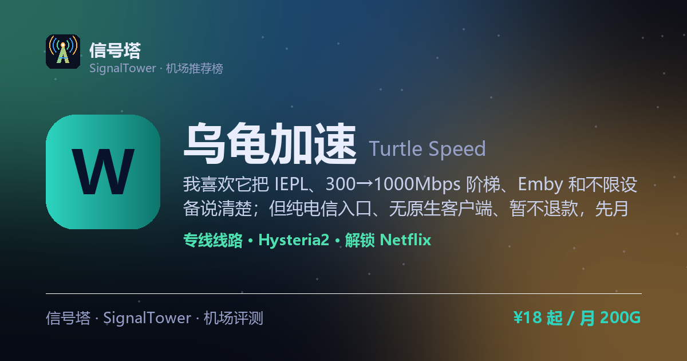

> 我喜欢它把 IEPL、300→1000Mbps 阶梯、Emby 和不限设备说清楚；但纯电信入口、无原生客户端、暂不退款，先月付。

- **线路类型**：IEPL 专线（全系专线传输）
- **主要协议**：Hysteria2 · Shadowsocks · Trojan
- **流媒体解锁**：Netflix · Disney+ · ChatGPT · YouTube · TikTok
- **覆盖地区**：新加坡 · 香港 · 日本 · 美国 · 土耳其 等 20+ 节点（电信 BGP 入口 / Amazon 落地）
- **起步价**：¥18 起 / 月 200G（月付（至 3 年付）/ 不限时买断流量包）
- **最适合**：IEPL 专线 + EMBY 追剧

名字叫乌龟，配置倒不磨叽：全系 IEPL，带宽按 300→1000Mbps 明标，每档送 Emby、设备不限，3000G/6000G 不限时包也能做长期备用。问题同样明显：纯电信 BGP 入口让移动、联通跨网体验略逊，没有原生客户端得自己配，而且暂不支持退款；2025 新站更别拿买断包豪赌。我的建议是先小额月付验证晚高峰，跑稳再考虑长约。家庭追剧党可试。

**完整评测与优惠信息 → [乌龟加速 Turtle Speed 机场评测](https://555736.xyz/wugui/)**

### 18. 跨境Cloud KuaJing Cloud 机场推荐  ·  「跨境电商专线」

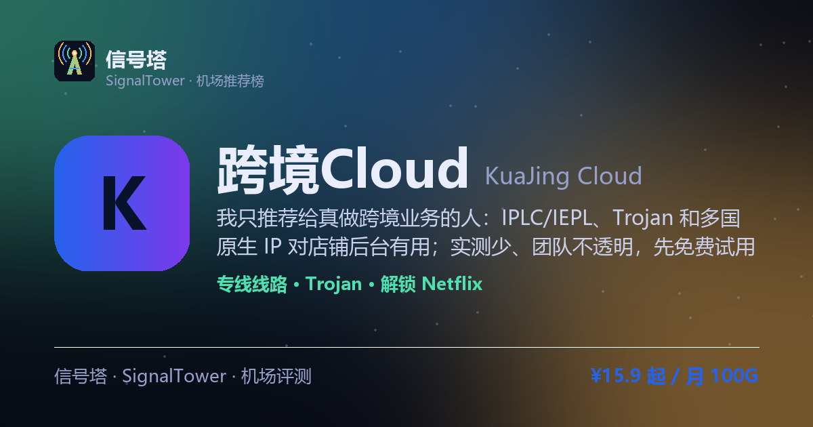

> 我只推荐给真做跨境业务的人：IPLC/IEPL、Trojan 和多国原生 IP 对店铺后台有用；实测少、团队不透明，先免费试用。

- **线路类型**：全系 IPLC/IEPL 专线（三档会员分级）
- **主要协议**：Trojan
- **流媒体解锁**：Netflix · HBO · Disney+ · ChatGPT · Gemini
- **覆盖地区**：全球多国、七大洲原生 IP（跨境电商 / 跨境贸易专线专属）
- **起步价**：¥15.9 起 / 月 100G（月付 / 季付 / 半年 / 年付（三档会员分级））
- **最适合**：跨境电商 / 商用出海专线

它把跨境电商场景做得比普通机场认真：IPLC/IEPL 三档、Trojan、全平台客户端和多国原生 IP，带宽与设备数也按档位明标，登录多国店铺后台顺手还能解锁流媒体和 AI。可商用两个字不能替代证据，公开第三方实测偏少、团队信息不透明。我会先用免费试用，再月付小额验证晚高峰和常用国家，跑稳才考虑长约；别一上来大额年付。真做跨境的再看。

**完整评测与优惠信息 → [跨境Cloud KuaJing Cloud 机场评测](https://555736.xyz/kuajing/)**

### 19. M78星云 M78 Nebula 机场推荐  ·  「稀有节点·Emby」

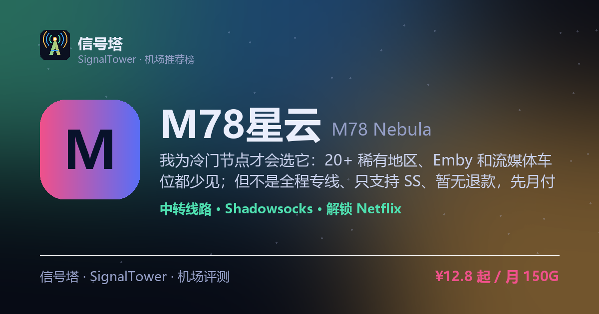

> 我为冷门节点才会选它：20+ 稀有地区、Emby 和流媒体车位都少见；但不是全程专线、只支持 SS、暂无退款，先月付。

- **线路类型**：BGP 中转 + IEPL 游戏专线（含 Premium 线路）
- **主要协议**：Shadowsocks
- **流媒体解锁**：Netflix · Disney+ · ChatGPT
- **覆盖地区**：港 · 新 · 日 · 台 · 美 等热门 + 南极 · 尼日利亚 · 埃及 · 阿根廷 · 乌克兰 · 丹麦 等 20+ 稀有地区（共 40+ 落地）
- **起步价**：¥12.8 起 / 月 150G（月付 / 季付 / 半年 / 年付 + 不过期流量包）
- **最适合**：稀有节点 + Emby 影视

要南极、尼日利亚、埃及、阿根廷这类冷门落地，我会先看 M78：热门加稀有共 40+ 节点，还有 Emby 影视库和高级档流媒体账号车位，玩法确实少见。别被 2000Mbps 和「IEPL 游戏专线」几个字带跑，它主体是 BGP 中转、不是全程专线，中级档也不含游戏专线/Premium，协议只有 SS，而且明确暂无退款。先月付小额验证三网晚高峰，再上车。

**完整评测与优惠信息 → [M78星云 M78 Nebula 机场评测](https://555736.xyz/m78star/)**

### 20. OuO 机场推荐

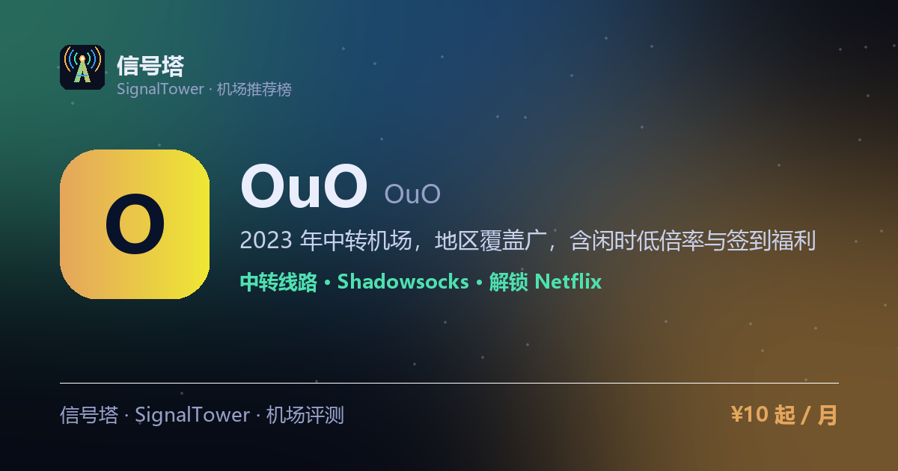

> 2023 年中转机场，地区覆盖广，含闲时低倍率与签到福利

- **线路类型**：公网隧道中转
- **主要协议**：Shadowsocks
- **流媒体解锁**：Netflix · Disney+ · YouTube · TikTok · ChatGPT
- **覆盖地区**：香港 · 日本 · 台湾 · 新加坡 · 美国 · 德国 · 英国 等
- **起步价**：¥10 起 / 月（包月 / 包季 / 包年）
- **最适合**：多地区解锁

节点地区多、解锁场景全，闲时低倍率是加分项；第三方口碑两极、部分反馈售后偏慢，建议先小额月付实测。

**完整评测与优惠信息 → [OuO 机场评测](https://555736.xyz/ouo/)**

### 21. 69云 69Yun 机场推荐

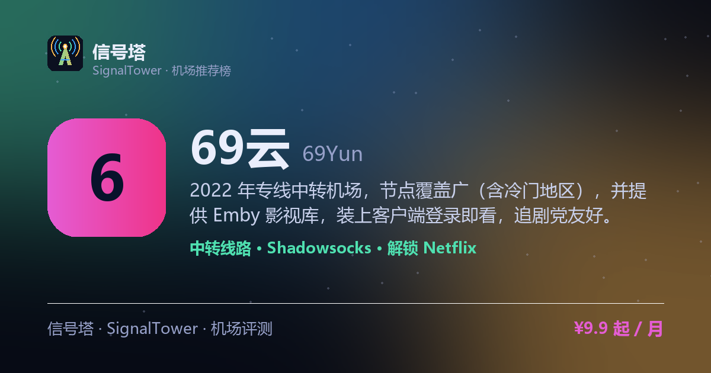

> 2022 年专线中转机场，节点覆盖广（含冷门地区），并提供 Emby 影视库，装上客户端登录即看，追剧党友好。

- **线路类型**：专线中转
- **主要协议**：Shadowsocks · VMess
- **流媒体解锁**：Netflix · Disney+ · HBO · ChatGPT · Emby 影视库
- **覆盖地区**：亚洲 · 欧美 · 含多个冷门地区
- **起步价**：¥9.9 起 / 月（包月 / 按量）
- **最适合**：冷门地区 / Emby 影音

节点覆盖面广、冷门地区有优势，套餐多样，还提供 Emby 影视库——登录即看片，稳定、速度快，UP 主在用，适合主力或备用；建议先低价月付验证晚高峰与解锁，再考虑长期。

**完整评测与优惠信息 → [69云 69Yun 机场评测](https://555736.xyz/yun69/)**

### 22. 蛋挞机场 DanTa 机场推荐

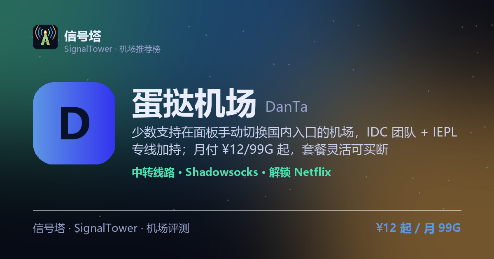

> 少数支持在面板手动切换国内入口的机场，IDC 团队 + IEPL 专线加持；月付 ¥12/99G 起，套餐灵活可买断

- **线路类型**：公网隧道中转 + IEPL 专线
- **主要协议**：Shadowsocks
- **流媒体解锁**：Netflix · Disney+ · YouTube Premium · ChatGPT · TikTok
- **覆盖地区**：港台新 · 日美韩 等，另有澳门等冷门节点
- **起步价**：¥12 起 / 月 99G（包月 / 按量）
- **最适合**：多入口进阶

亮点是可在面板手动挑国内入口（同类少见），团队做 IDC 出身、后续加入 IEPL 专线，诚意在线；套餐灵活，月付低至 ¥12/99G，也提供 ¥40 起的不限时买断流量包；新站且换过站长，建议先免费试用/月付观察过渡期。

**完整评测与优惠信息 → [蛋挞机场 DanTa 机场评测](https://555736.xyz/danta/)**

### 23. KTM Cloud 机场推荐

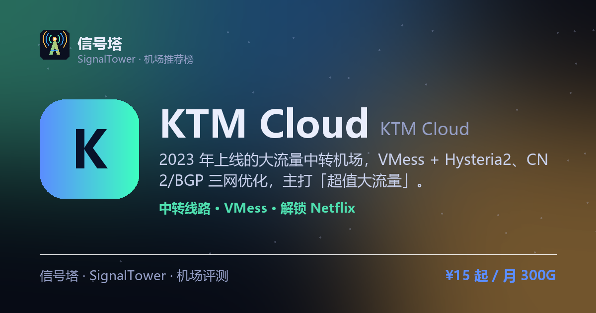

> 2023 年上线的大流量中转机场，VMess + Hysteria2、CN2/BGP 三网优化，主打「超值大流量」。

- **线路类型**：CN2/BGP 中转 + 专线
- **主要协议**：VMess · Hysteria2
- **流媒体解锁**：Netflix · Disney+ · ChatGPT · TikTok
- **覆盖地区**：香港 · 日本 · 美国 · 新加坡 · 德国 · 韩国 · 台湾 等
- **起步价**：¥15 起 / 月 300G（月付 / 永久流量包）
- **最适合**：大流量 / 性价比

KTM Cloud 是 2023 年上线的中转机场，采用 VMess + Hysteria2 双协议、CN2/BGP 三网优化，卖点是「便宜大碗」的大流量与永久流量包，不限设备、支付宝/微信付款方便。它覆盖港日美新德韩台等地，日常追剧与 ChatGPT 可用，但解锁与稳定性在测评中有一定争议，官网也曾出现因被攻击而中断的情况。适合预算有限、流量需求大的用户当性价比主力或备用，务必先小额验证、别大额预付。

**完整评测与优惠信息 → [KTM Cloud 机场评测](https://555736.xyz/ktmcloud/)**

### 24. 牛逼 Niubi 机场推荐

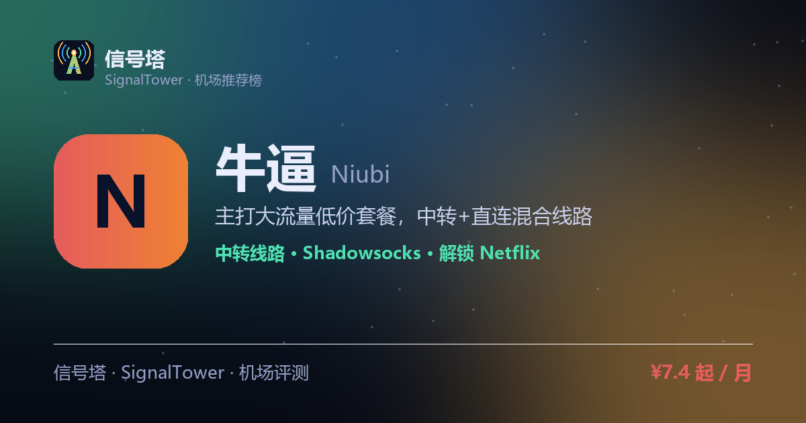

> 主打大流量低价套餐，中转+直连混合线路

- **线路类型**：公网中转 + 直连混合
- **主要协议**：Shadowsocks · VMess · Trojan
- **流媒体解锁**：Netflix · Disney+ · ChatGPT
- **覆盖地区**：香港 · 日本 · 新加坡 · 美国 等
- **起步价**：¥7.4 起 / 月（包月 / 按量）
- **最适合**：大流量党

以超大流量、低单价为卖点，日常刷剧下载性价比高；低价机场稳定性一般，建议先月付小额验证。

**完整评测与优惠信息 → [牛逼 Niubi 机场评测](https://555736.xyz/niubi/)**

### 25. 雪山机场 XueShan 机场推荐

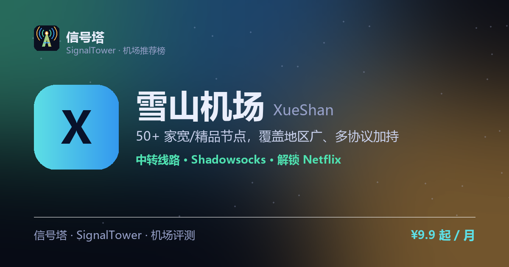

> 50+ 家宽/精品节点，覆盖地区广、多协议加持

- **线路类型**：家宽 / 中转线路
- **主要协议**：Shadowsocks · Trojan · Hysteria2 · VLESS
- **流媒体解锁**：Netflix · Disney+ · ChatGPT
- **覆盖地区**：香港 · 台湾 · 韩国 · 日本 · 新加坡 · 美国 · 德国 · 法国 · 俄罗斯 等
- **起步价**：¥9.9 起 / 月（包月 / 包年 / 流量包）
- **最适合**：日常全能

2025 年上线，主打节点多、覆盖广，家宽/中转配合多协议，适合视频/会议/ChatGPT 日常；作为较新机场，建议先小额付费观察稳定性。

**完整评测与优惠信息 → [雪山机场 XueShan 机场评测](https://555736.xyz/xueshan/)**

### 26. 游隼云 YouSun 机场推荐

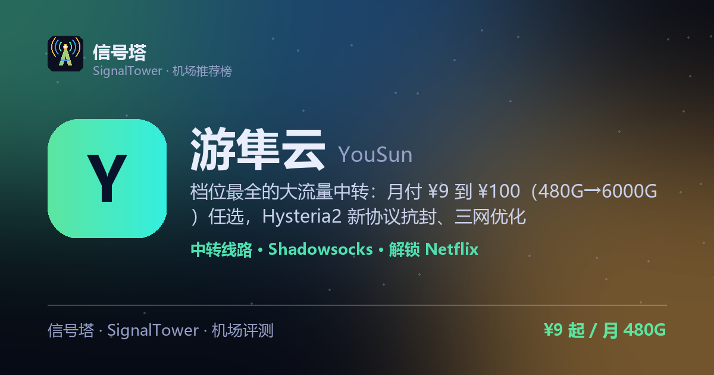

> 档位最全的大流量中转：月付 ¥9 到 ¥100（480G→6000G）任选，Hysteria2 新协议抗封、三网优化

- **线路类型**：三网优化中转
- **主要协议**：Shadowsocks · Trojan · Hysteria2
- **流媒体解锁**：Netflix · Disney+ · ChatGPT
- **覆盖地区**：美国 · 日本 · 香港 · 台湾 · 新加坡 等
- **起步价**：¥9 起 / 月 480G（包月 / 不限时买断）
- **最适合**：大流量月付

主打大流量与多地区原生 IP，协议较新、抗封是卖点；套餐从 ¥9/480G 到 ¥100/6000G 月付档位齐全，另有 ¥15 起的不限时买断包（防失联用）；节点数与真实速度建议自行小额测试。

**完整评测与优惠信息 → [游隼云 YouSun 机场评测](https://555736.xyz/yousun/)**

### 27. Hneko云机场 Hneko 机场推荐

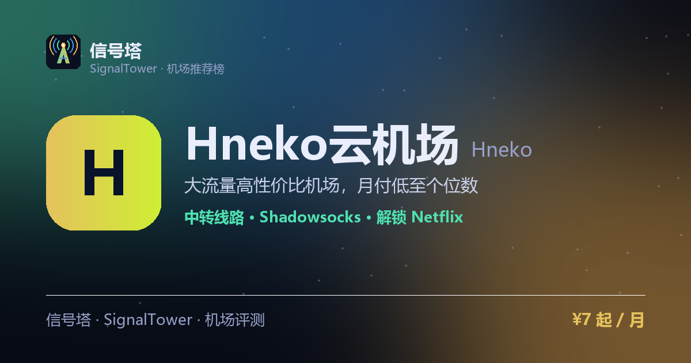

> 大流量高性价比机场，月付低至个位数

- **线路类型**：公网隧道中转
- **主要协议**：Shadowsocks · Trojan · VMess
- **流媒体解锁**：Netflix · ChatGPT
- **覆盖地区**：香港 · 日本 · 美国 等
- **起步价**：¥7 起 / 月（包月 / 包年 / 不限时）
- **最适合**：大流量党

以大流量、低价著称，套餐含月付/年付/不限时多种；据用户反馈节点稳定性时有波动、需留意订阅更新，建议先月付验证。

**完整评测与优惠信息 → [Hneko云机场 Hneko 机场评测](https://555736.xyz/hneko/)**

### 28. 超实惠加速 ChaoShiHui 机场推荐

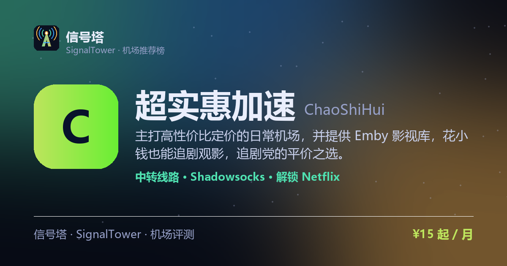

> 主打高性价比定价的日常机场，并提供 Emby 影视库，花小钱也能追剧观影，追剧党的平价之选。

- **线路类型**：中转 / 直连（以官网为准）
- **主要协议**：Shadowsocks · Trojan · VLESS
- **流媒体解锁**：Netflix · ChatGPT · Emby 影视库
- **覆盖地区**：香港 · 日本 · 美国 等（以官网为准）
- **起步价**：¥15 起 / 月（包月 / 按量）
- **最适合**：高性价比 / Emby 影音

定位「价格实惠、够用就好」，适合日常轻中度使用，还提供 Emby 影视库——装上客户端登录即看，稳定、速度快，UP 主在用；公开独立测速数据有限，套餐与稳定性以官网为准，先小额验证。

**完整评测与优惠信息 → [超实惠加速 ChaoShiHui 机场评测](https://555736.xyz/chaoshihui/)**

### 29. 凌云加速 LingYun 机场推荐

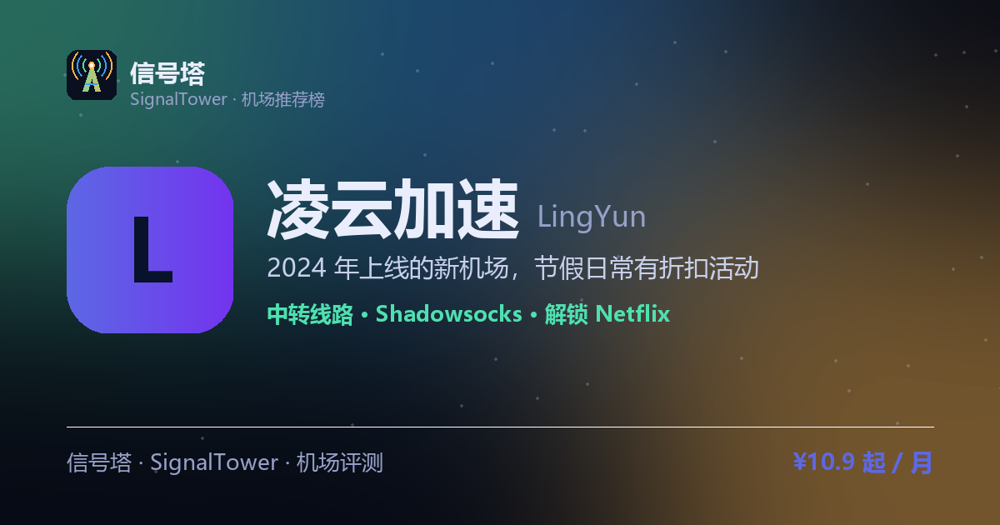

> 2024 年上线的新机场，节假日常有折扣活动

- **线路类型**：中转（线路细节未公开确认）
- **主要协议**：Shadowsocks · Trojan · VMess
- **流媒体解锁**：Netflix · Disney+ · ChatGPT
- **覆盖地区**：香港 · 日本 · 美国 等（以官网为准）
- **起步价**：¥10.9 起 / 月（包月 / 包季 / 包年）
- **最适合**：低价尝鲜

成立时间较短、公开评测有限，社区有个别关于稳定性/客服的负面反馈；建议只用最低档月付实测，确认稳定再续。

**完整评测与优惠信息 → [凌云加速 LingYun 机场评测](https://555736.xyz/lingyun/)**

### 30. 极速机场 JiSu 机场推荐

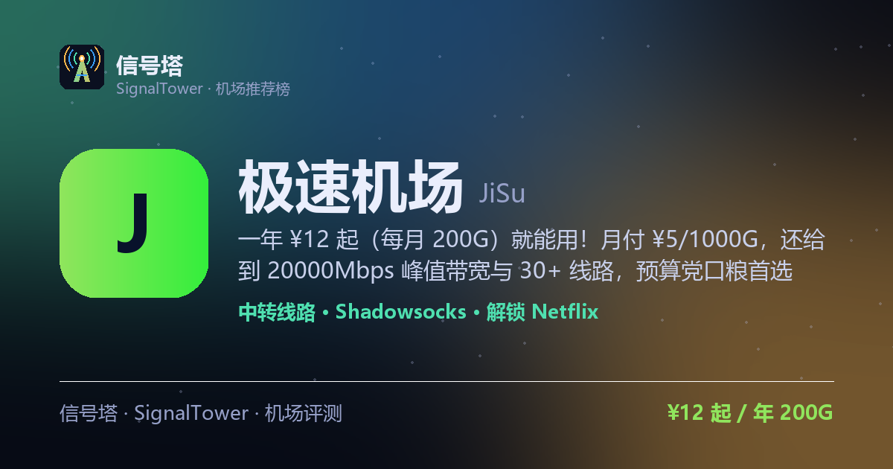

> 一年 ¥12 起（每月 200G）就能用！月付 ¥5/1000G，还给到 20000Mbps 峰值带宽与 30+ 线路，预算党口粮首选

- **线路类型**：中转（多线路）
- **主要协议**：Shadowsocks · Trojan · Hysteria2
- **流媒体解锁**：Netflix · Disney+ · ChatGPT
- **覆盖地区**：香港 · 日本 · 新加坡 · 美国 等 30+ 线路
- **起步价**：¥12 起 / 年 200G（包月 / 包年 / 不限时买断）
- **最适合**：预算优先入门

低价入门档，月付 ¥5/1000G 起、年付每月 200G 仅 ¥12，另有不限时买断包，性价比是主卖点；低价机场抗风险能力有限，先小额月付验证。

**完整评测与优惠信息 → [极速机场 JiSu 机场评测](https://555736.xyz/jisu/)**

### 31. 良心云 Liangxin 机场推荐

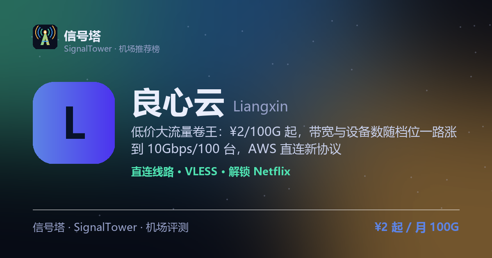

> 低价大流量卷王：¥2/100G 起，带宽与设备数随档位一路涨到 10Gbps/100 台，AWS 直连新协议

- **线路类型**：AWS 直连线路
- **主要协议**：VLESS · Hysteria2
- **流媒体解锁**：Netflix · Disney+ · ChatGPT · TikTok
- **覆盖地区**：香港 · 日本 · 新加坡 · 韩国 · 美国 等
- **起步价**：¥2 起 / 月 100G（包月 / 不限时买断）
- **最适合**：低价尝鲜党

价格低、协议新（VLESS/Hy2），解锁反馈尚可；但运营时间短、直连机场普遍不稳定，强烈建议只用最低档月付观察，别直接年付。

**完整评测与优惠信息 → [良心云 Liangxin 机场评测](https://555736.xyz/liangxin/)**

### 32. 一分机场 YiFen 机场推荐

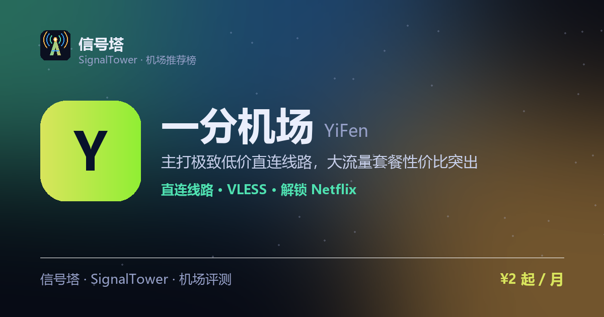

> 主打极致低价直连线路，大流量套餐性价比突出

- **线路类型**：直连（大厂云，无专线）
- **主要协议**：VLESS · Hysteria2
- **流媒体解锁**：Netflix · ChatGPT · bilibili
- **覆盖地区**：三网直连线路（地区以官网为准）
- **起步价**：¥2 起 / 月（包月 / 不限时）
- **最适合**：低价大流量

低价直连+大流量为卖点，价格档位丰富、日常性价比高；直连稳定性不及专线、晚高峰可能波动，先最低档月付验证再加量。

**完整评测与优惠信息 → [一分机场 YiFen 机场评测](https://555736.xyz/yifen/)**

### 33. 顶级机场 DingJi 机场推荐

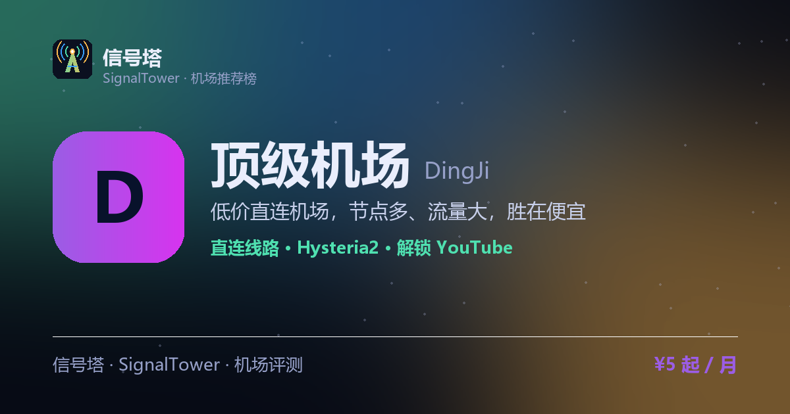

> 低价直连机场，节点多、流量大，胜在便宜

- **线路类型**：公网直连
- **主要协议**：Hysteria2 · VLESS
- **流媒体解锁**：YouTube · ChatGPT
- **覆盖地区**：美国 · 日本 · 香港 · 台湾 · 新加坡 · 韩国 等
- **起步价**：¥5 起 / 月（包月 / 按量）
- **最适合**：价格敏感重流量

走直连路线（Azure/AWS 入口），价格低、节点流量足，适合价格极敏感的大流量用户；速度受本地运营商影响大、节点 IP 更新频繁，不适合商务稳定场景。

**完整评测与优惠信息 → [顶级机场 DingJi 机场评测](https://555736.xyz/dingji/)**

### 34. 赔钱机场 PeiQian 机场推荐

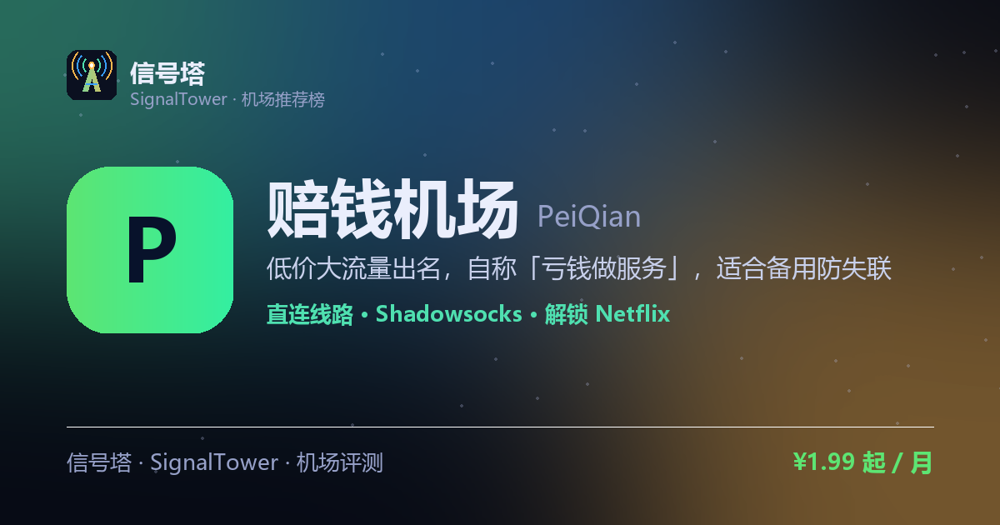

> 低价大流量出名，自称「亏钱做服务」，适合备用防失联

- **线路类型**：全直连 / 部分中转
- **主要协议**：Shadowsocks · Trojan · VMess · VLESS · Hysteria2
- **流媒体解锁**：Netflix · ChatGPT · TikTok
- **覆盖地区**：香港 · 日本 · 美国 · 新加坡 等（含甲骨文云节点）
- **起步价**：¥1.99 起 / 月（包月流量包 / 不限时）
- **最适合**：极致低价备用

价格数一数二便宜、流量给得足，还有 0.1/0.01 超低倍率节点可薅；但全直连晚高峰与电信体验有限，建议只当备用、先月付小额验证。

**完整评测与优惠信息 → [赔钱机场 PeiQian 机场评测](https://555736.xyz/peiqian/)**

### 35. 卷王机场 JuanWang 机场推荐

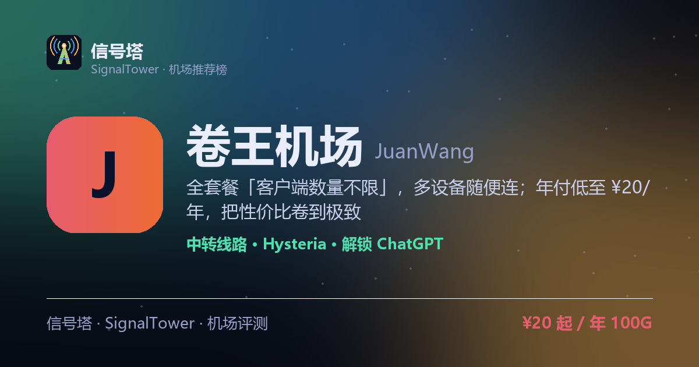

> 全套餐「客户端数量不限」，多设备随便连；年付低至 ¥20/年，把性价比卷到极致

- **线路类型**：公网隧道中转
- **主要协议**：Hysteria · Trojan · VLESS · VMess
- **流媒体解锁**：ChatGPT · TikTok
- **覆盖地区**：美国 · 香港 · 台湾 · 新加坡 · 日本 · 英国 · 加拿大 · 德国 等 11 地区
- **起步价**：¥20 起 / 年 100G（年付 / 月付 / 不限时买断）
- **最适合**：多设备不限 · 年付党

最大亮点是所有套餐「客户端数量不限制」——多设备、全家共享、软路由都不受台数限制，这在同价位机场里相当少见；再加上年付 ¥20 起（每月 100G）的白菜价、订单日自动重置，名副其实的「卷王」。覆盖 11 个地区、入口优化中转；官方禁止滥用分享（发现封号），深度稳定性数据较少，建议先月付或不限时小额验证。

**完整评测与优惠信息 → [卷王机场 JuanWang 机场评测](https://555736.xyz/juanwang/)**

### 36. 清风云 QingFeng 机场推荐

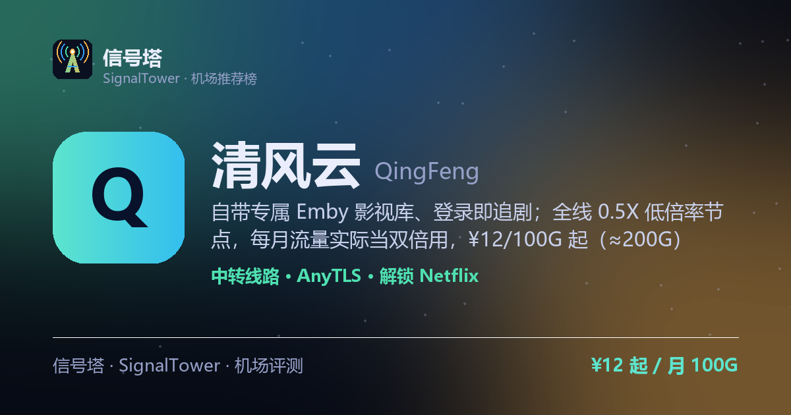

> 自带专属 Emby 影视库、登录即追剧；全线 0.5X 低倍率节点，每月流量实际当双倍用，¥12/100G 起（≈200G）

- **线路类型**：公网隧道中转
- **主要协议**：AnyTLS · VLESS · Hysteria · Shadowsocks
- **流媒体解锁**：Netflix · Disney+ · ChatGPT · Emby 影视库
- **覆盖地区**：香港 · 日本 · 美国 等
- **起步价**：¥12 起 / 月 100G（月付 / 季付 / 半年 / 年付）
- **最适合**：Emby 追剧 / 流量翻倍

两大亮点很抓人：一是内置专属 Emby 私人影视库，装客户端登录即看、追剧免找片源；二是全线 0.5X 低倍率节点，100G 套餐实际可当 200G 用，性价比拉满。再加 AnyTLS 新协议、月/季/半年/年多周期、10 台设备同连，适合预算有限又想追剧的轻量党。公开评测较少、官方无退款，建议先月付小额验证。

**完整评测与优惠信息 → [清风云 QingFeng 机场评测](https://555736.xyz/qingfeng/)**

### 37. 飞狗 FeiGou 机场推荐

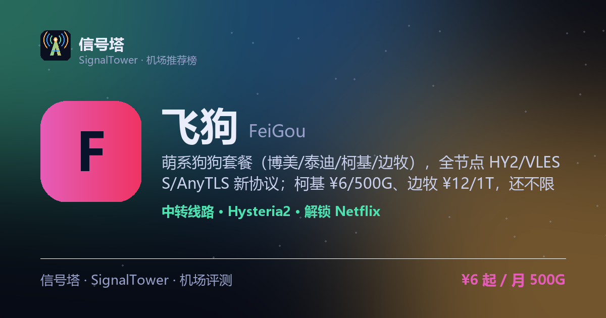

> 萌系狗狗套餐（博美/泰迪/柯基/边牧），全节点 HY2/VLESS/AnyTLS 新协议；柯基 ¥6/500G、边牧 ¥12/1T，还不限在线客户端

- **线路类型**：公网隧道中转
- **主要协议**：Hysteria2 · VLESS · AnyTLS
- **流媒体解锁**：Netflix · YouTube · ChatGPT
- **覆盖地区**：香港 · 台湾 · 日本 · 美国 等
- **起步价**：¥6 起 / 月 500G（月付 / 季付 / 不限时买断）
- **最适合**：大流量低价 · 不限设备

把「便宜、大流量、不限设备」凑齐的口粮机场：柯基档 ¥6/月就有 500G、边牧 ¥12/月给到 1T，且所有套餐不限制在线客户端、多设备随便连；全节点上了 HY2/VLESS/AnyTLS 新协议、购买日免费重置。属低价走量、历史上换过网址，建议保存最新地址、先小额月付验证，别当唯一主力。

**完整评测与优惠信息 → [飞狗 FeiGou 机场评测](https://555736.xyz/feigou/)**

### 38. 顺畅网络 ShunChang 机场推荐

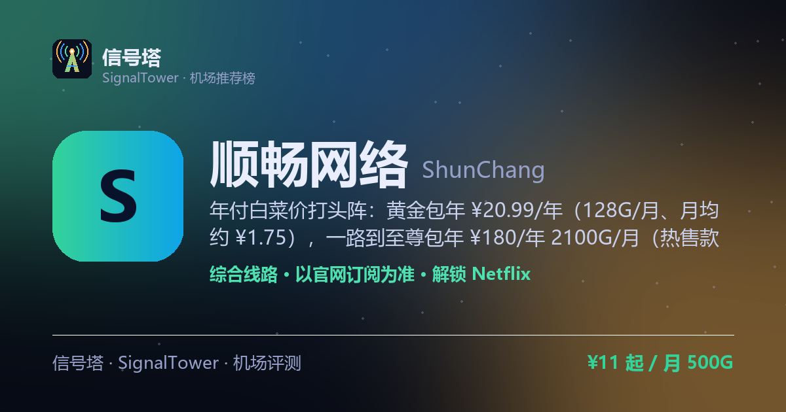

> 年付白菜价打头阵：黄金包年 ¥20.99/年（128G/月、月均约 ¥1.75），一路到至尊包年 ¥180/年 2100G/月（热售款）；月付 ¥11/500G 起、按量『不限时流量』300G ¥15.99 起买断、上到 ¥900/月专线定制——月付/季付/半年/年付 + 按量不限时 + 专线定制十几档任选，全档标称无限速带宽、32 个国家/地区节点、多设备同时在线

- **线路类型**：线路类型官网未公开（另有 ¥900/月 专线定制档）
- **主要协议**：以官网订阅为准
- **流媒体解锁**：Netflix · Disney+ · YouTube
- **覆盖地区**：32 个国家/地区节点、30+ 高速节点（官网未点名具体城市，登录后查节点）
- **起步价**：¥11 起 / 月 500G（月付 / 季付 / 半年 / 年付 + 按量不限时买断（另有专线定制））
- **最适合**：年付白菜价 · 计费最全

顺畅网络（scl168 系列站点，官网自称『顺畅加速』）主打『计费档位全站最全 + 年付白菜价』：一边是白菜级整年年付——黄金包年 ¥20.99/年（128G/月、月均约 ¥1.75）、白金 ¥39.99/年 380G、钻石 ¥88/年 660G、大师 ¥130.99/年 1100G、至尊 ¥180/年 2100G（热售款）；一边是月付（¥11/500G 起，另有季付 ¥32、半年 ¥66、年付 ¥80）、按量一次性不限时买断（300G ¥15.99 到 5000G ¥130）乃至 ¥900/月专线定制，十几档任意挑，全档标称无限速带宽、32 个国家/地区节点、多设备同时在线。注意它线路类型与协议官网未在未登录页公开、第三方评测与社区口碑基本空白，且 scl168.club 下有多个同名域名，属低知名度新站，务必认准官方地址、先小额月付验证晚高峰与解锁，再考虑年付/买断。

**完整评测与优惠信息 → [顺畅网络 ShunChang 机场评测](https://555736.xyz/shunchang/)**

## Emby 影音机场推荐

下面这几家在订阅之外还 **内置 / 赠送 Emby 私人影视库**：装上 Emby 客户端、用机场提供的账号登录即可在线看片，相当于自带一个「私人奈飞」，省去自己找片源。它们 **稳定、速度快，UP 主与追剧党常用**。片源、清晰度与可用性以各机场官网实时信息为准。

- 🎬 **[守候 Shouhou](https://555736.xyz/shouhou/)** — 我愿意长期观察的 2020 老牌：中转 + 专线、低倍率节点和 Emby 都齐；再老也先月付，别把年付当信仰。
- 🎬 **[糖果云 CandyCloud](https://555736.xyz/candycloud/)** — 我拿它当追剧专机：IEPL + 全档 Emby + 不限设备，¥18/100G 起；新站先月付验晚高峰，别一上来锁三年。
- 🎬 **[红杏云 HongXing](https://555736.xyz/hongxing/)** — 我看中的是 IEPL、全档 Emby 和便宜大流量，连不限时买断都有；但新站域名多，先认官网、先月付，别急着囤。
- 🎬 **[渔云 YuYun](https://555736.xyz/yuyun/)** — 我把它当 IEPL + Emby 的新锐组合：协议新、主流地区够用；但新站别谈信仰，先月付小额跑稳再续。
- 🎬 **[好鸭 NiceDuck](https://555736.xyz/niceduck/)** — 我把它当追剧型中转：2023 年开、入口多、套餐带 Emby；协议只有 SS，先月付验证，别因为送片库就上头。
- 🎬 **[乌龟加速 Turtle Speed](https://555736.xyz/wugui/)** — 我喜欢它把 IEPL、300→1000Mbps 阶梯、Emby 和不限设备说清楚；但纯电信入口、无原生客户端、暂不退款，先月付。
- 🎬 **[M78星云 M78 Nebula](https://555736.xyz/m78star/)** — 我为冷门节点才会选它：20+ 稀有地区、Emby 和流媒体车位都少见；但不是全程专线、只支持 SS、暂无退款，先月付。
- 🎬 **[69云 69Yun](https://555736.xyz/yun69/)** — 2022 年专线中转机场，节点覆盖广（含冷门地区），并提供 Emby 影视库，装上客户端登录即看，追剧党友好。
- 🎬 **[超实惠加速 ChaoShiHui](https://555736.xyz/chaoshihui/)** — 主打高性价比定价的日常机场，并提供 Emby 影视库，花小钱也能追剧观影，追剧党的平价之选。
- 🎬 **[清风云 QingFeng](https://555736.xyz/qingfeng/)** — 自带专属 Emby 影视库、登录即追剧；全线 0.5X 低倍率节点，每月流量实际当双倍用，¥12/100G 起（≈200G）

## 机场快速对比表

一张表看懂 **机场对比**：线路、协议、解锁能力、起步价与适用场景。适合搜索「机场哪家好」「机场性价比对比」时快速筛选。

| 机场 | 线路类型 | 主要协议 | 解锁 | 起步价 | 最适合 |
| --- | --- | --- | --- | --- | --- |
| [Mitce](https://555736.xyz/mitce/) | 直连（部分 BGP 中转） | VLESS+Reality · Hysteria2 | Netflix · Disney+ · ChatGPT | ¥4 / 月 100G | 性价比 / 新手主推 |
| [西部数据](https://555736.xyz/westdata/) | IEPL/IPLC 全专线 | Trojan | Netflix · Disney+ · ChatGPT | ¥17 / 200G | 稳定专线党 |
| [守候](https://555736.xyz/shouhou/) | 公网中转 + IPLC 专线 | Shadowsocks | Netflix · Disney+ · ChatGPT · Emby 影视库 | ¥15 / 月 | 稳健老用户 / Emby 影音 |
| [糖果云](https://555736.xyz/candycloud/) | IEPL 专线 | Shadowsocks · V2Ray | Netflix · Disney+ · ChatGPT · Emby 影视库 | ¥18 / 月 100G | 影视追剧旗舰 |
| [红杏云](https://555736.xyz/hongxing/) | IEPL 专线 | Trojan · Hysteria2 | Netflix · Disney+ · ChatGPT · Emby 影视库 | ¥20 / 月 200G | 流媒体 / 大流量性价比 |
| [自由猫](https://555736.xyz/freecat/) | MPTCP 多路径中转 | Shadowsocks · Trojan · VLESS | Netflix · Disney+ · ChatGPT | ¥6 / 月 | 日常主力 |
| [淘气兔](https://555736.xyz/taoqitu/) | 中转 + IEPL 专线 | Shadowsocks · Trojan | Netflix · ChatGPT | ¥7.8 / 月 | 联通移动用户 |
| [渔云](https://555736.xyz/yuyun/) | IEPL 专线 + 中转 | VLESS · Hysteria2 | Netflix · Disney+ · ChatGPT · Emby 影视库 | ¥9 / 月 | 长期稳定 / Emby 影音 |
| [神龙](https://555736.xyz/shenlong/) | 全线 IEPL 专线 | Shadowsocks · VMess · Trojan | Netflix · Disney+ · ChatGPT | ¥10 / 月 100G | IEPL 专线 · 永久流量 |
| [边界云加速器](https://555736.xyz/lvpn/) | 优化中转（官网称 IEPL 优化线路 · 尊享 Pro 含国内低延迟专线入口） | VLESS | ChatGPT · Claude · Gemini · Netflix · Disney+ · YouTube 4K | ¥9.97 / 月 50G | AI 优化 + 稳定办公 |
| [Tapcloud](https://555736.xyz/tapcloud/) | 公网中转（含 IEPL 专线档） | VLESS-Vision · Hysteria2 · AnyTLS | Netflix · Disney+ · ChatGPT · MyTVSuper · HBO · Bahamut | ¥12 / 月 100G | 全平台流媒体解锁 |
| [Tifa](https://555736.xyz/tifa/) | 线路未公开（登录后查节点状态） | 以官网订阅为准 | Netflix · Disney+ · YouTube | ¥20 / 月 100G | 不限设备 · 平价口粮 |
| [快雷GO](https://555736.xyz/kuailei/) | IEPL 专线 + 直连 | AnyTLS · VLESS | Netflix · Disney+ · ChatGPT · TikTok | ¥20 / 月 150G | 专线加速 · 全设备档 |
| [好鸭](https://555736.xyz/niceduck/) | 多入口隧道中转 | Shadowsocks | Netflix · Disney+ · YouTube · ChatGPT · Emby 影视库 | ¥12 / 月 | 追剧兼解锁 |
| [流量光](https://555736.xyz/llguang/) | BGP 中转 + 专线可选 | Trojan · Shadowsocks | Netflix · Disney+ · HBO · Spotify · TikTok · ChatGPT | ¥9.9 / 月 | 流媒体重度 |
| [NiceCloud](https://555736.xyz/nicecloud/) | 公网中转隧道 | Shadowsocks · SSR | Netflix · Disney+ · ChatGPT · TikTok | ¥12 / 月起 | 性价比 / 灵活流量 |
| [乌龟加速](https://555736.xyz/wugui/) | IEPL 专线（全系专线传输） | Hysteria2 · Shadowsocks · Trojan | Netflix · Disney+ · ChatGPT · YouTube · TikTok | ¥18 / 月 200G | IEPL 专线 + EMBY 追剧 |
| [跨境Cloud](https://555736.xyz/kuajing/) | 全系 IPLC/IEPL 专线（三档会员分级） | Trojan | Netflix · HBO · Disney+ · ChatGPT · Gemini | ¥15.9 / 月 100G | 跨境电商 / 商用出海专线 |
| [M78星云](https://555736.xyz/m78star/) | BGP 中转 + IEPL 游戏专线（含 Premium 线路） | Shadowsocks | Netflix · Disney+ · ChatGPT | ¥12.8 / 月 150G | 稀有节点 + Emby 影视 |
| [OuO](https://555736.xyz/ouo/) | 公网隧道中转 | Shadowsocks | Netflix · Disney+ · YouTube · TikTok · ChatGPT | ¥10 / 月 | 多地区解锁 |
| [69云](https://555736.xyz/yun69/) | 专线中转 | Shadowsocks · VMess | Netflix · Disney+ · HBO · ChatGPT · Emby 影视库 | ¥9.9 / 月 | 冷门地区 / Emby 影音 |
| [蛋挞机场](https://555736.xyz/danta/) | 公网隧道中转 + IEPL 专线 | Shadowsocks | Netflix · Disney+ · YouTube Premium · ChatGPT · TikTok | ¥12 / 月 99G | 多入口进阶 |
| [KTM Cloud](https://555736.xyz/ktmcloud/) | CN2/BGP 中转 + 专线 | VMess · Hysteria2 | Netflix · Disney+ · ChatGPT · TikTok | ¥15 / 月 300G | 大流量 / 性价比 |
| [牛逼](https://555736.xyz/niubi/) | 公网中转 + 直连混合 | Shadowsocks · VMess · Trojan | Netflix · Disney+ · ChatGPT | ¥7.4 / 月 | 大流量党 |
| [雪山机场](https://555736.xyz/xueshan/) | 家宽 / 中转线路 | Shadowsocks · Trojan · Hysteria2 · VLESS | Netflix · Disney+ · ChatGPT | ¥9.9 / 月 | 日常全能 |
| [游隼云](https://555736.xyz/yousun/) | 三网优化中转 | Shadowsocks · Trojan · Hysteria2 | Netflix · Disney+ · ChatGPT | ¥9 / 月 480G | 大流量月付 |
| [Hneko云机场](https://555736.xyz/hneko/) | 公网隧道中转 | Shadowsocks · Trojan · VMess | Netflix · ChatGPT | ¥7 / 月 | 大流量党 |
| [超实惠加速](https://555736.xyz/chaoshihui/) | 中转 / 直连（以官网为准） | Shadowsocks · Trojan · VLESS | Netflix · ChatGPT · Emby 影视库 | ¥15 / 月 | 高性价比 / Emby 影音 |
| [凌云加速](https://555736.xyz/lingyun/) | 中转（线路细节未公开确认） | Shadowsocks · Trojan · VMess | Netflix · Disney+ · ChatGPT | ¥10.9 / 月 | 低价尝鲜 |
| [极速机场](https://555736.xyz/jisu/) | 中转（多线路） | Shadowsocks · Trojan · Hysteria2 | Netflix · Disney+ · ChatGPT | ¥12 / 年 200G | 预算优先入门 |
| [良心云](https://555736.xyz/liangxin/) | AWS 直连线路 | VLESS · Hysteria2 | Netflix · Disney+ · ChatGPT · TikTok | ¥2 / 月 100G | 低价尝鲜党 |
| [一分机场](https://555736.xyz/yifen/) | 直连（大厂云，无专线） | VLESS · Hysteria2 | Netflix · ChatGPT · bilibili | ¥2 / 月 | 低价大流量 |
| [顶级机场](https://555736.xyz/dingji/) | 公网直连 | Hysteria2 · VLESS | YouTube · ChatGPT | ¥5 / 月 | 价格敏感重流量 |
| [赔钱机场](https://555736.xyz/peiqian/) | 全直连 / 部分中转 | Shadowsocks · Trojan · VMess · VLESS · Hysteria2 | Netflix · ChatGPT · TikTok | ¥1.99 / 月 | 极致低价备用 |
| [卷王机场](https://555736.xyz/juanwang/) | 公网隧道中转 | Hysteria · Trojan · VLESS · VMess | ChatGPT · TikTok | ¥20 / 年 100G | 多设备不限 · 年付党 |
| [清风云](https://555736.xyz/qingfeng/) | 公网隧道中转 | AnyTLS · VLESS · Hysteria · Shadowsocks | Netflix · Disney+ · ChatGPT · Emby 影视库 | ¥12 / 月 100G | Emby 追剧 / 流量翻倍 |
| [飞狗](https://555736.xyz/feigou/) | 公网隧道中转 | Hysteria2 · VLESS · AnyTLS | Netflix · YouTube · ChatGPT | ¥6 / 月 500G | 大流量低价 · 不限设备 |
| [顺畅网络](https://555736.xyz/shunchang/) | 线路类型官网未公开（另有 ¥900/月 专线定制档） | 以官网订阅为准 | Netflix · Disney+ · YouTube | ¥11 / 月 500G | 年付白菜价 · 计费最全 |

## 30 秒教你怎么选机场

- **我想压低口粮成本，日常刷视频、挂 AI 或不限量敞开用** → 选 [Mitce](https://555736.xyz/mitce/)
- **我把低延迟和常年稳定放第一，也能接受双向计流量** → 选 [西部数据](https://555736.xyz/westdata/)
- **我想找运营多年的主力，同时用 Emby 省掉找片源** → 选 [守候](https://555736.xyz/shouhou/)
- **我重度追剧，要 IEPL、Emby 和家庭多设备共享** → 选 [糖果云](https://555736.xyz/candycloud/)
- **我既要追剧又要囤大流量，并愿意先月付验证新站** → 选 [红杏云](https://555736.xyz/hongxing/)
- **我最烦晚高峰堵车，想试多路径聚合做日常主力** → 选 [自由猫](https://555736.xyz/freecat/)
- **我是联通或移动用户，想在中转和 IEPL 之间灵活切换** → 选 [淘气兔](https://555736.xyz/taoqitu/)
- **我要 IEPL 做主力，也想套餐顺手送 Emby 追剧** → 选 [渔云](https://555736.xyz/yuyun/)
- **我想要 IEPL 的稳和快，又不想每个月续费** → 选 [神龙](https://555736.xyz/shenlong/)
- **我主要跑 ChatGPT、Claude、Gemini，也需要稳定办公入口** → 选 [边界云加速器](https://555736.xyz/lvpn/)
- **我港剧、日漫、欧美剧都追，想少切几家解锁线路** → 选 [Tapcloud](https://555736.xyz/tapcloud/)
- **我家里设备多，想压低并发成本又不被限速** → 选 [Tifa](https://555736.xyz/tifa/)
- **我要海外专线速度，设备规模从个人一路扩到团队** → 选 [快雷GO](https://555736.xyz/kuailei/)
- **我想用一份中转订阅追剧、解锁，再顺手拿 Emby** → 选 [好鸭](https://555736.xyz/niceduck/)
- **我重度刷 Netflix、Disney+、HBO，还想自己调流量和设备数** → 选 [流量光](https://555736.xyz/llguang/)
- **我用量不固定，想按量或不限时慢慢扣** → 选 [NiceCloud](https://555736.xyz/nicecloud/)
- **我要 IEPL、Emby 和不限设备全家用，也能接受先配客户端** → 选 [乌龟加速](https://555736.xyz/wugui/)
- **我做跨境电商，要稳定登录多国店铺后台，顺带解锁 AI 和流媒体** → 选 [跨境Cloud](https://555736.xyz/kuajing/)
- **我要冷门国家落地 IP，也想顺带用 Emby 和流媒体权益** → 选 [M78星云](https://555736.xyz/m78star/)

更多场景与全部收录见线上 **[机场大全](https://555736.xyz/airports/)**。

## 新手入门：第一次用机场

1. **选机场**：按上面场景选 1 家主力 + 1 家备用（降低跑路 / 故障风险）。
2. **买套餐**：优先 **月付 / 小流量**，确认晚高峰与解锁后再考虑季付年付。
3. **装客户端**：Windows 用 Clash Verge / v2rayN；macOS 用 Clash Verge；Android 用 Hiddify / v2rayNG；iOS 用 Shadowrocket。
4. **导入订阅**：复制机场订阅链接 → 客户端更新节点 → 选延迟低的节点连接。
5. **协议注意**：含 **Hysteria2** 的机场，请用支持该协议的客户端，否则导入会报错。

### 避坑要点

- 先买月付 / 小流量档验证稳定性，别一上来就大额年付。
- 老牌机场通常更稳；新机场先小档试水。
- 同时备用 2–3 家机场互为容灾。
- 价格、节点、优惠码以官网实时信息为准。

## 常见问题 FAQ

### 机场是什么？和 VPN 有什么区别？

「**机场**」是对提供 Shadowsocks / V2Ray / Trojan / VLESS 等 **代理订阅服务** 的俗称：购买套餐后得到订阅链接，导入客户端即可使用多个节点。相比传统单一入口 VPN，机场通常 **节点更多、切换更灵活**，更常用于流媒体解锁与低延迟场景。

### 2026 年怎么选靠谱的科学上网机场？

先明确需求：要 **IEPL/IPLC 专线稳定**、要 **性价比口粮**、还是要 **Netflix/Emby 追剧**。再看运营时长、是否支持月付、晚高峰表现与解锁列表。本仓库的 [精选榜单](#2026-精选机场榜单) 与 [对比表](#机场快速对比表) 就是按这个逻辑整理的。

### 机场会不会跑路？怎么降低风险？

行业存在停服 / 跑路风险。建议：优先运营时间较长的机场；**月付试水**；**2–3 家备用**；不要把大额年付压在单一新站上。

### 本仓库和官方站是什么关系？

本仓库与 [555736.xyz](https://555736.xyz/) 为 **第三方信息与推荐平台**，非任何机场官方。页面可能含推广链接；你通过链接注册或购买时我们可能获得佣金，**不会增加你的成本**。

## 相关搜索词

若你是通过以下关键词找到本页，说明路线对了：**机场推荐**、**机场评测**、**科学上网机场**、**翻墙机场推荐**、**稳定机场**、**IEPL 专线机场**、**性价比机场**、**不限量机场**、**Netflix 解锁机场**、**ChatGPT 机场**、**Clash 订阅机场**、**V2Ray 机场**、**Trojan 机场**、**VLESS Reality 机场**、**Hysteria2 机场**、**2026 机场榜单**。

品牌相关：Mitce、西部数据 / WestData、守候 / Shouhou、糖果云 / CandyCloud、红杏云 / HongXing、自由猫 / FreeCat、淘气兔 / TaoQiTu、渔云 / YuYun、神龙 / ShenLong、边界云加速器 / LVPN、Tapcloud、Tifa 等机场评测均可在本站检索。

## 免责声明

本仓库与站点为第三方信息与推荐平台，非任何机场官方；页面内含推广链接，若你通过链接注册或购买，我们可能获得一定佣金，但不会增加你的任何成本。各机场的线路、价格、优惠码可能随时变动，请以对应官网实时信息为准。代理 / 加密技术的使用需遵守你所在国家或地区的法律法规，本站内容仅供学习与技术研究参考。

---

<p align="center">⭐ 觉得有用请给仓库点 Star，方便以后搜索「信号塔」「SignalTower」「机场推荐 github」时找到我们<br><a href="https://555736.xyz/">访问机场推荐站</a> · <a href="https://github.com/signaltowers/signaltowers.github.io">GitHub 仓库</a> · <a href="https://555736.xyz/airports/">机场大全</a></p>

